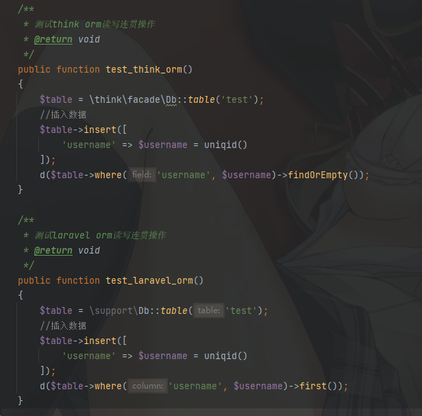
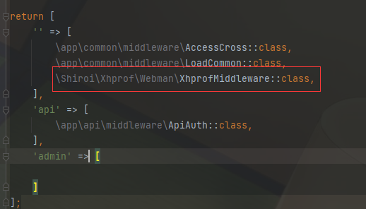

# webman-shiroi管理后台
基于`webman`的后台管理系统,tp框架90%相似度,熟练tp上手就能用

## webman文档
https://www.workerman.net/doc/webman/install.html

## apidoc文档
https://hg-code.gitee.io/apidoc-php/use/

## composer 安装
`php composer install`

## 安装依赖
- php7.4+
- composer
- redis

## 安装步骤
- 配置`yml`文件
   1. 创建文件`application.yml`,到项目`根目录`(`copy example.application.yml application.yml`)
   2. 修改配置文件`application-local.yml`

- 配置完成后
   1. 执行`php vendor/bin/phinx migrate`进行表迁移
   2. 执行`php vendor/bin/phinx seed:run`进行数据迁移

## 注意事项
- 使用apidoc生成接口文档时，需要默认`use hg\apidoc\annotation as Apidoc;`到使用的控制器中去

## 扩展功能
- ### thinkorm | eloquent orm 都可使用,测试案例可看文件`api/controller/TestController.php`
  
- ### 自动记录所有数据库操作行为,记录在`runtime/sql_logs`目录下
- ### apidoc接口文档,访问`域名/apidoc/index.html`
- ### 定时任务,在`process/Task.php`中定义你的定时任务
- ### redis队列,具体操作请查看文档https://www.workerman.net/doc/webman/queue/redis.html
- ### 配置了xhprof性能分析
   1. 把文件根目录下文件`php_xhprof-2.3.0-7.4-nts-vc15-x64.zip`解压配置到php扩展文件,并配置`php.ini`
   2. php.ini文件配置
      ```ini
      [xhprof]
      extension=xhprof
      ```
   3. 不使用可以直接到`middleware.php`下注释`\Shiroi\Xhprof\Webman\XhprofMiddleware::class`并`composer remove shiroi/xhprof-webman`
      